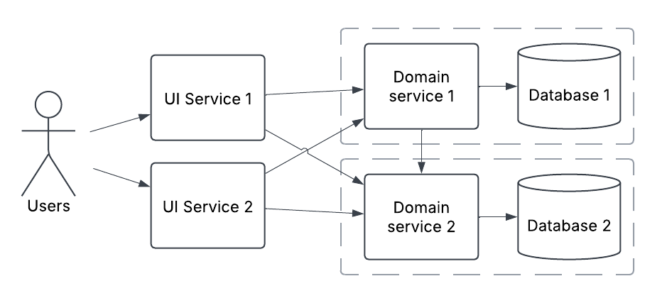

# ADR029 - TITLE

- **Status**: Draft
- **Date**: 2025-02-25
- **Author**: Joshua Taylor MBCS

## Decision

<!-- 
    In a few sentences, describe the decision taken. 
-->

## Context

Since its inception, a microservices architecture style was followed for the
family hubs services. This is defined as distributing the business logic of
family hubs into multiple independently hosted components
([ADR007](./ADR007-use-azure-app-services.md)), each with an exclusive
database([ADR002](./ADR002-use-a-managed-azure-database.md)). These services are
permitted to communicate with each other. Then another layer of independently
hosted UI components would communicate with these services via HTTP
([ADR001](./ADR001-use-http-for-inter-service-comms.md)) as needed to retrieve
data or process business transactions.

According to the previous architect, the main justification for adopting this
architectural style was its scalable and elastic characteristics -- since if the
system came under high user load, each small component could quickly (due to
their size) allocate new resources to deal with the load.

As the family hubs services reached later stages of development and more of the
team turned over, the team found little evidence that large user loads would
appear.

The team also found maintaining the microservices architecture quite arduous,
since any new feature would likely cut across multiple components and require
coordination between components. It also seemed quite wasteful in terms of
resource usage.

Given this revision and the ongoing struggles of the development team, it was
questioned whether the architecture style could be changed to reduce unnecessary
complexity and reduce the costs of changing the service.

## Options considered

<!-- 
    Briefly describe each option considered as a numbered list. Start with the selected option.
    It's usually wise to include a 'do nothing' option.

    e.g.

    1. (SELECTED) PostgreSQL
    2. Oracle
    3. SQL Server  
-->

## Consequences

### Option 1 - Single service with virtual hosts and a single database

- Would be the simplest possible architecture from a component stand-point,
  which would:
  - ease the process of making changes
  - improve developer experience, although opinions differ on this in the team
  - ease developer onboarding

- Could potentially improve overall service performance, since HTTP requests
  would be replaced with method calls.

- May be overall more reliable, since network faults would not interfere with
  message passing within the system.

- Would decrease the scalability of the services, since the entire product 
  would need to scale together. Due to its size, this would take more resources
  compared to separate components at higher loads.

- Since the entire service would be deployed together, this may lead to more
  overall downtime in the system -- for example a database migration might make
  the entire service unavailable instead of in just one component.

- Would be well suited to the current single-team structure.

- The deployment and testing pipelines may take a little longer to run.

### Option 2 - Domain service consolidation

- Would be simpler than the current architecture which would improve its ability
  to change and improve the developer experience; perhaps comparably to option 1
  although opinions vary.

- Would slightly decrease the scalability of the services, since the UI components 
  and domain components could each independently scale but not to the degree of
  option 3.

- Changes to just one UI component would reduce the system-under-test for
  regression testing, since both UI components are isolated, thereby reducing
  test effort. However a change to the domain service would necessarily always
  need a full regression.

- Changes to the database requiring downtime would necessarily cause downtime in
  all services.

### Option 3 - Do nothing, retaining current microservices architecture

- Current issues with developer experience and complexity would remain -- likely
  slowing future development and testing efforts.

- Would scale better if the service started to experience high loads.

- More fault tolerance is possible, since independently hosted components can
  also fail or error independently.

- If transactions or data consistency are required in the future between
  services, this would be harder to facilitate if components are distributed.

- Is usually adopted in scenarios with lots of teams working independently,
  which does not match the current family hubs programme structure.

## Advice

- For option 1, I would start to be concerned with scaling. I also don't see a
  huge impact on developer experience between options 1 and 2. As we go down to
  fewer components, we make deployments riskier and the system as a whole less
  fault tolerant. (Aaron Yarborough, Lead developer, 2025-02-27)

- In theory a single service would mean more regression testing, but in practice
  we tend to need to regression test everything for each change. The single
  service would lead to a long running CI pipeline and it would make it harder
  to detect where performance issues are. Keeping the separation of domain/UI
  components would help with performance testing, and may allow for situations
  where we just need to regression test part of the system for a change. (Tina
  Gohil, Test engineer, 2025-02-27)

- Any simplification of the architecture would lead to better [impact
  analysis](https://en.wikipedia.org/wiki/Change_impact_analysis). But the
  benefits of this are negligible since regression testing isn't our bottleneck
  right now. Also with improvements to our automated test approach, the need to
  work out regression testing scope becomes less significant. Component changes
  wouldn't significantly change the  CI/CD pipeline running time, team practices
  and preferences affect this much more.  (Dami Laleye, Test engineer,
  2025-02-28)

- A monolith would be a much better developer experience -- we would have more
  control, the system would be easier to think about and onboarding new
  developers would be much easier. Our team size is also not suited to
  microservices. (Zac King, Developer, 2025-02-26)

- Thomas Cheyney, Developer (YYYY-MM-DD)

- Stuart Maskell, Developer (YYYY-MM-DD)

- Paul Armstrong, DevOps Engineer (YYYY-MM-DD)
