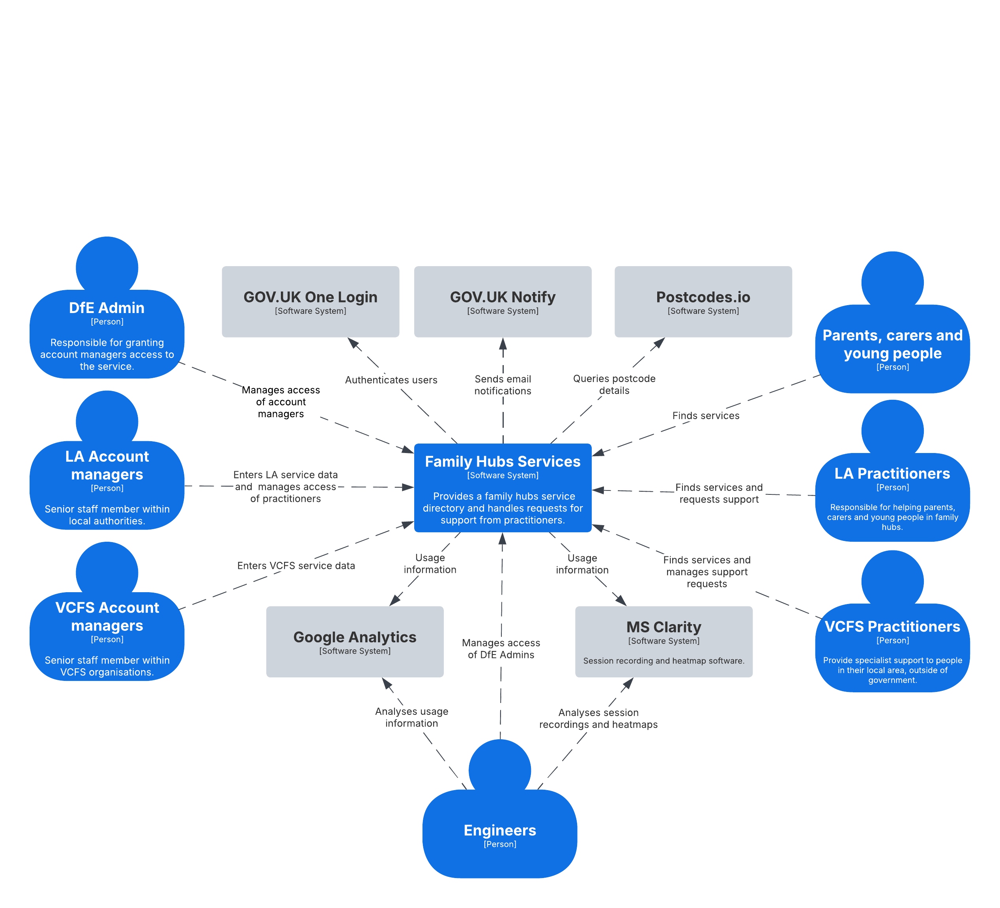

# Family Hubs High Level Design Document

## Glossary

- FH - Family hubs
- FX - Family experience
- IS - Information Sharing
- MVS - Minimal Viable Service
- VCS – Voluntary Community Services
- LA – Local Authority

## Problem Statement

This document provides details of the high-level design for the Vulnerable Children and Families portfolio Family Hubs digital service. It consists of two user-facing services:

1. **Single directory:** Allows public users to browse a national service directory and
   allows professional and voluntary users to refer families to services.
2. **Manage:** Allows administration of service data and user accounts

## Architecture

The following C4 models provide a high-level overview of the Family Hubs architecture.

### C1 View

Snapshot from 18 Mar 2025.

### C2 View

Snapshot from 18 Mar 2025.

## Service Information

### Third Parties

We use the following third party services:

- **Postcodes.io:** Free service for postcode lookups
- **GOV.UK One Login:** Authentication service
- **GOV.UK Notify:** Email notification service

### Services

Family Hubs consists of the following services:

#### UIs

- **Single directory:** lets users find services in their area through a postcode search and
  allows LAs to connect families with services through connection requests.
- **Manage:** allows LA and VCS users to manage their data, view metrics, and other administrative tasks
- **IdAM Maintenance:** allows members of the Family Hubs team to add new DfE Admin, LA and VCS users

#### APIs

- **Service Directory**: stores a host of Family Hubs data (services, organisations, locations, languages, etc.) and related CRUD endpoints
- **Referral**: stores connection requests, and offers connection request-related CRUD endpoints
- **IdAM**: stores user accounts and other user-related data, and offers auth-related endpoints
- **Notification**: offers endpoints to interact with GOV.UK Notify for email notifications
- **Report**: stores KPI and reporting data, and offers endpoints to retrieve it

#### Functions

- **Open Referral Pull Services Webhook**: used to pull service data from local authorities into the Data Exchange Data Store

### Hosting and Environments

We have the following environments deployed within the CIP infrastructure on Azure:
- **Development**: deployed in the Development subscription
- **Test 1**: deployed in the Test subscription
- **Test 2**: deployed in the Test subscription
- **Pre-Production**: deployed in the Production subscription
- **Production**: deployed in the Production subscription

### Networking

- Virtual network with private endpoints
- Network security groups for traffic control

### Compute

Services run as app services within an app service plan on Azure.

### Storage

- Storage accounts for logging data and Terraform plans
- Additional storage for static custom error pages

### Security

- Authentication via GOV.UK One Login
- Authorization via IdAM service
- TLS termination  and WAF rules via Application Gateway
- Secrets management using Azure Key Vault
- Cyber attack protection (WAF, OWASP, Bot protection)
- NCSC WebCheck for security profiling
- Access to SQL Servers secured by firewall IP whitelist

### Databases

- SQL Server managed instances hosted on Azure
- Easy DTU scaling provided to easily scale to accommodate load as necessary

## Support and Maintenance

- Azure resources deployed in Common Infrastructure Platform (CIP)
- Monitoring and alerting provided by the team and Azure platform
- Access control to Azure with user/password + 2FA, and PIM for Test and Production subscriptions access

## Logging, Monitoring, and Alerting

- Google Analytics for client-side events
- Azure App Insights for service analytics
- Alerting via Log Analytics in Azure Monitor
- Microsoft Clarify for screen recordings, use behaviour tracking, and life performance metrics

## Data Storage & Retention

- PII data retained for 7 years, then anonymized
- Service directory data retained indefinitely
- Other data (e.g., IdAM) retained for 1 year
- Data encrypted in flight and at rest
- Additional encryption for PII data

## DNS

Public DNS records for each site (Single directory, Manage) as subdomains of education.gov.uk.

## Patch & Update Management

PaaS services in Azure handle patch and update management. Renovate enabled for the GitHub mono repo to alert us to/automatically raise PRs for dependency updates

## Resilience/Fault Tolerance

Provided by application plan and container orchestration in PaaS services. Application plan auto scales to n number of containers to support load.

## Disaster Recovery

- Daily and weekly backups to storage account
- Recovery Point Objective: 24 hours
- Recovery Time Objective: 24 hours (maximum)

## DevOps

- Single GitHub repository for all Family Hubs services and Terraform IaC
- Managed pipeline in GitHub Actions for both code and IAC deployments
- Open-source code management with feature branching and Pull Requests

## Assurances

- Various testing types (unit, regression, code security, accessibility, end-to-end, performance)
- IT Health Checks and penetration tests performed every 2 years, or when moving to new live statuses as per GDS and DfE guidelines
