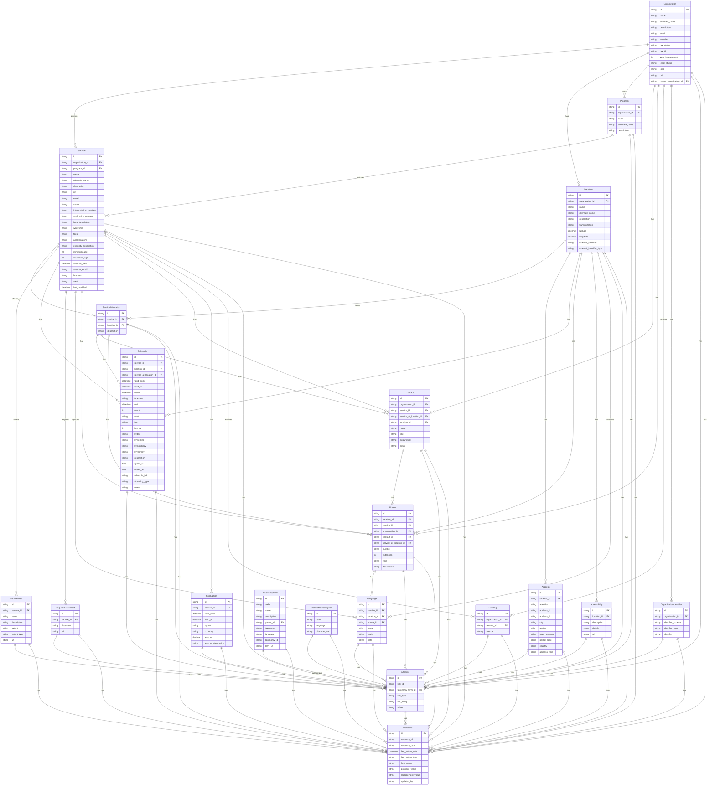

# HSDS v3.0 entity relationships

Lists and visualises HSDS relationships.

```mermaid
erDiagram
    Organization {
        string id PK
        string name
        string alternate_name
        string description
        string email
        string website
        string tax_status
        string tax_id
        int year_incorporated
        string legal_status
        string logo
        string uri
        string parent_organization_id FK
    }

    Service {
        string id PK
        string organization_id FK
        string program_id FK
        string name
        string alternate_name
        string description
        string url
        string email
        string status
        string interpretation_services
        string application_process
        string fees_description
        string wait_time
        string fees
        string accreditations
        string eligibility_description
        int minimum_age
        int maximum_age
        datetime assured_date
        string assurer_email
        string licenses
        string alert
        datetime last_modified
    }

    Location {
        string id PK
        string organization_id FK
        string name
        string alternate_name
        string description
        string transportation
        decimal latitude
        decimal longitude
        string external_identifier
        string external_identifier_type
    }

    Program {
        string id PK
        string organization_id FK
        string name
        string alternate_name
        string description
    }

    ServiceAtLocation {
        string id PK
        string service_id FK
        string location_id FK
        string description
    }

    ServiceArea {
        string id PK
        string service_id FK
        string name
        string description
        string extent
        string extent_type
        string uri
    }

    RequiredDocument {
        string id PK
        string service_id FK
        string document
        string uri
    }

    CostOption {
        string id PK
        string service_id FK
        datetime valid_from
        datetime valid_to
        string option
        string currency
        decimal amount
        string amount_description
    }

    Funding {
        string id PK
        string organization_id FK
        string service_id FK
        string source
    }

    OrganizationIdentifier {
        string id PK
        string organization_id FK
        string identifier_scheme
        string identifier_type
        string identifier
    }

    Phone {
        string id PK
        string location_id FK
        string service_id FK
        string organization_id FK
        string contact_id FK
        string service_at_location_id FK
        string number
        int extension
        string type
        string description
    }

    Schedule {
        string id PK
        string service_id FK
        string location_id FK
        string service_at_location_id FK
        datetime valid_from
        datetime valid_to
        datetime dtstart
        string timezone
        datetime until
        int count
        string wkst
        string freq
        int interval
        string byday
        string byweekno
        string bymonthday
        string byyearday
        string description
        time opens_at
        time closes_at
        string schedule_link
        string attending_type
        string notes
    }

    Address {
        string id PK
        string location_id FK
        string attention
        string address_1
        string address_2
        string city
        string region
        string state_province
        string postal_code
        string country
        string address_type
    }

    Accessibility {
        string id PK
        string location_id FK
        string description
        string details
        string url
    }

    Language {
        string id PK
        string service_id FK
        string location_id FK
        string phone_id FK
        string name
        string code
        string note
    }

    Contact {
        string id PK
        string organization_id FK
        string service_id FK
        string service_at_location_id FK
        string location_id FK
        string name
        string title
        string department
        string email
    }

    Attribute {
        string id PK
        string link_id
        string taxonomy_term_id FK
        string link_type
        string link_entity
        string value
    }

    TaxonomyTerm {
        string id PK
        string code
        string name
        string description
        string parent_id FK
        string taxonomy
        string language
        string taxonomy_id
        string term_uri
    }

    Metadata {
        string id PK
        string resource_id
        string resource_type
        datetime last_action_date
        string last_action_type
        string field_name
        string previous_value
        string replacement_value
        string updated_by
    }

    MetaTableDescription {
        string id PK
        string name
        string language
        string character_set
    }

    
    Organization ||--o{ Service : provides
    Organization ||--o{ Location : has
    Organization ||--o{ Program : runs
    Organization ||--o{ Contact : has
    Organization ||--o{ Phone : has
    Organization ||--o{ Funding : receives
    Organization ||--o{ OrganizationIdentifier : has
    Service ||--o{ ServiceAtLocation : offered_at
    Service ||--o{ ServiceArea : covers
    Service ||--o{ Schedule : has
    Service ||--o{ RequiredDocument : requires
    Service ||--o{ Language : supports
    Service ||--o{ Phone : has
    Service ||--o{ Contact : has
    Service ||--o{ CostOption : has
    Service ||--o{ Funding : receives
    Location ||--o{ ServiceAtLocation : hosts
    Location ||--o{ Address : has
    Location ||--o{ Schedule : has
    Location ||--o{ Phone : has
    Location ||--o{ Accessibility : has
    Location ||--o{ Language : supports
    Program ||--o{ Service : includes
    ServiceAtLocation ||--o{ Schedule : has
    ServiceAtLocation ||--o{ Contact : has
    ServiceAtLocation ||--o{ Phone : has
    Contact ||--o{ Phone : has
    Phone ||--o{ Language : has
    TaxonomyTerm ||--o{ Attribute : categorizes
    Organization ||--o{ Attribute : has
    Service ||--o{ Attribute : has
    Location ||--o{ Attribute : has
    Program ||--o{ Attribute : has
    ServiceAtLocation ||--o{ Attribute : has
    ServiceArea ||--o{ Attribute : has
    RequiredDocument ||--o{ Attribute : has
    CostOption ||--o{ Attribute : has
    Funding ||--o{ Attribute : has
    OrganizationIdentifier ||--o{ Attribute : has
    Phone ||--o{ Attribute : has
    Schedule ||--o{ Attribute : has
    Address ||--o{ Attribute : has
    Accessibility ||--o{ Attribute : has
    Language ||--o{ Attribute : has
    Contact ||--o{ Attribute : has
    Organization ||--o{ Metadata : has
    Service ||--o{ Metadata : has
    Location ||--o{ Metadata : has
    Program ||--o{ Metadata : has
    ServiceAtLocation ||--o{ Metadata : has
    ServiceArea ||--o{ Metadata : has
    RequiredDocument ||--o{ Metadata : has
    CostOption ||--o{ Metadata : has
    Funding ||--o{ Metadata : has
    OrganizationIdentifier ||--o{ Metadata : has
    Phone ||--o{ Metadata : has
    Schedule ||--o{ Metadata : has
    Address ||--o{ Metadata : has
    Accessibility ||--o{ Metadata : has
    Language ||--o{ Metadata : has
    Contact ||--o{ Metadata : has
    Attribute ||--o{ Metadata : has
    TaxonomyTerm ||--o{ Metadata : has
    MetaTableDescription ||--o{ Attribute: has
    MetaTableDescription ||--o{ Metadata: has
```
