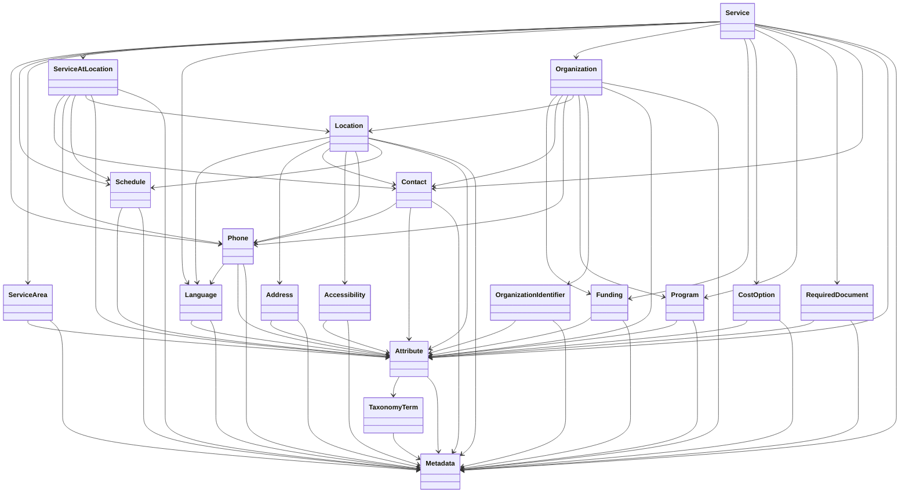

## Automatically generate Umbraco document types

To automatically generate Umbraco document types for Open Referral schemas (LOcations, Languages, Metadata, etc.), navigate to `/api/admintools/generate-open-referral-document-types`. This will kick off the generator, and statuses are logged to the console. You should see a log output:

```
[10:20:07 INF] Generating Open Referral document types... <---
```

And individual entries for each document type created:
```
[10:20:08 INF] Generated and created document type 'Accessibility'
```

**Note:** if you don't want document types to automatically be dropped and recreated if they already exist, change the `dropIfExists` parameter in `AdminToolsController.cs` to `false` before running:

```c#
await GenerateDocumentType(type, aaronUserGuid, dropIfExists: false);
```

**!!! Dropping and recreating document types will generate a new document type ID for the newly created type, which will unset the document type on any existing Umbraco content items that use it! Be careful when dropping and recreating!**

## 3rd party packages

This project uses the following 3rd party packages:

- [Humanizer](https://www.nuget.org/packages/Humanizer) - used for pluralising nouns when generating content types 

## Open Referral class dependency graph

The following dependency graph outlines which Open Referral classes/objects are dependent on which.



* The Organization class is a central entity, with relationships to many other classes such as Funding, Contact, Phone, Location, Program, OrganizationIdentifier, Attribute, and Metadata.
* The Service class is another key entity, connected to classes like Phone, Schedule, ServiceArea, ServiceAtLocation, Language, Organization, Funding, CostOption, Program, RequiredDocument, Contact, Attribute, and Metadata.
* The Location class has connections to Language, Address, Contact, Accessibility, Phone, Schedule, Attribute, and Metadata.
* The ServiceAtLocation class links Service and Location, and also has relationships with Contact, Phone, Schedule, Attribute, and Metadata.
* Most classes have a relationship with both Attribute and Metadata, indicating that these are common properties across many entities in the system.
* The Attribute class has a relationship with TaxonomyTerm, suggesting that attributes can be categorized or classified using a taxonomy system.